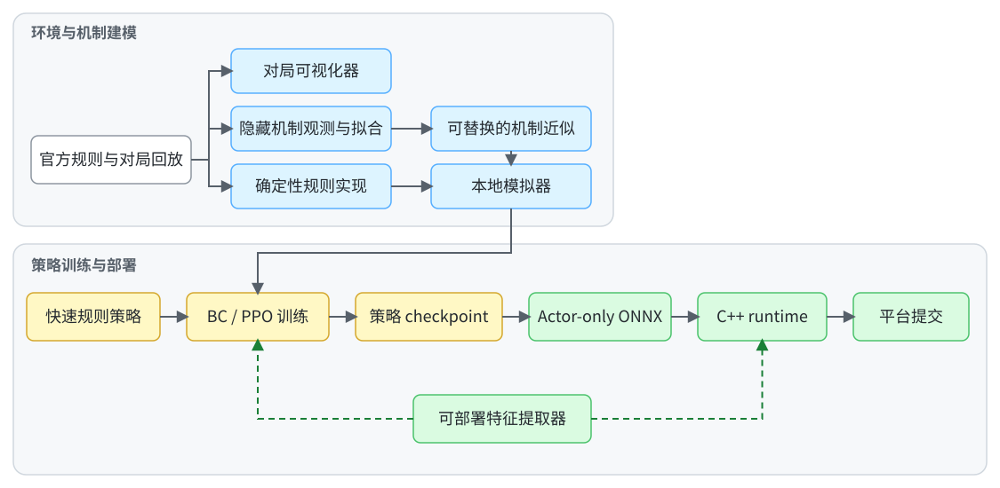

# GoldRush2：从隐藏机制建模到低延迟部署的强化学习系统

本仓库归档了为[九坤 GoldRush2.0](https://mp.weixin.qq.com/s/cP3MhQRIQNYhQag2bn4Enw)编程掘金争夺赛构建的一套完整强化学习系统：从规则整理、回放分析和隐藏机制近似出发，构建本地模拟器，训练部分可观测条件下的双角色联合策略，并将 Actor 导出到 C++/ONNX 提交环境。该系统最终取得官方 32 强成绩。

本仓库是个人参赛项目，并非比赛官方实现；其中 `official_sdk/` 是比赛官方提供的开发包。本项目的叙事复盘与反思将在个人博客中公开。

- [技术文档索引](docs/README.md)
- [游戏规则与术语](gamerules/gamerules.md)

## 问题设定

GoldRush2.0 在 `17 × 17` 网格上进行，两名玩家各控制两个角色，与 NPC 共同争夺金币。每回合，策略需要分配六步移动、决定两个角色的执行顺序，并选择是否购买视野。

这个问题的困难不只来自策略搜索：官方没有提供本地模拟器，部分金币、炸弹和 NPC 机制需要从回放中还原；玩家只能获得局部观测；四个角色的动作会相互改变后续局面；平台又按照策略响应速度决定双方行动先后，因此运行延迟也会改变策略实际面对的环境分布。

完整规则、平台接口与回放格式见 [`gamerules/`](gamerules/)。

## 系统总览

<picture>
  <source media="(prefers-color-scheme: dark)" srcset="docs/assets/system_overview-dark.svg">
  
</picture>

[查看系统图原图：浅色](docs/assets/system_overview-light.svg) · [深色](docs/assets/system_overview-dark.svg)

模拟器中的确定性规则与隐藏机制近似被有意分开：前者实现已确认的状态转移，后者根据观测数据拟合，并可在训练时替换或改变参数。Actor 特征提取器则由训练和部署共同使用，减少两条路径之间的语义漂移。

## 最终网络架构

网络采用参数完全独立的 Actor 与 Critic。Actor 只读取部署时可获得的局部观测及其历史信念；Critic 额外读取模拟器完整状态和 Actor 当时的信息态，只在 PPO 训练中估计价值，既不参与行为克隆，也不会进入最终提交模型。

<picture>
  <source media="(prefers-color-scheme: dark)" srcset="docs/assets/network_architecture-dark.svg">
  
</picture>

[查看网络图原图：浅色](docs/assets/network_architecture-light.svg) · [深色](docs/assets/network_architecture-dark.svg)

图中只保留理解策略所需的结构：空间编码、训练/部署边界和联合动作的条件依赖。精确的特征 schema、张量维度、概率分解及 checkpoint 兼容规则见 [`docs/policy_network_design.md`](docs/policy_network_design.md) 和 [`docs/features/`](docs/features/README.md)。

比赛前期的基础策略按慢速后手神经路径训练；比赛后期主线加入 conditional fast option，并训练 threshold head 控制下一回合的触发阈值。当前代码保留完整训练与部署实现，但通用训练 CLI 默认关闭 fast runtime，需要通过 `--enable-fast-runtime-features` 显式启用。

## 核心技术决策

| 问题 | 方案 | 代码与文档入口 |
| --- | --- | --- |
| 部分机制没有公开 | 从回放和受控对局中建立数据集，将机制近似与确定性规则分离 | [`mechanism/`](mechanism/)、[`simulator/`](simulator/) |
| 策略只能看到局部状态 | 维护可部署的历史观测与机制信念特征 | [`policy_runtime/`](policy_runtime/)、[`docs/features/`](docs/features/README.md) |
| 六步动作相互依赖 | 按真实执行顺序自回归生成动作，并在网络内递推角色位置 | [`docs/policy_network_design.md`](docs/policy_network_design.md) |
| 部分可观测使价值估计困难 | 使用同时读取完整状态和 Actor 信息态的 privileged critic | [`docs/rl_architecture.md`](docs/rl_architecture.md) |
| 终局目标稀疏且延迟 | 组合局部反馈与终局结果，并用 BC 初始化 Actor、PPO 完成优化 | [`docs/reward_design.md`](docs/reward_design.md) |
| 延迟会改变行动顺序 | 使用快速规则策略构造后手训练分布，并以 conditional fast path 在局部竞争中抢先执行 | [`fast_probing/`](fast_probing/)、[`docs/fast_option_design.md`](docs/fast_option_design.md)、[`docs/submission_pipeline.md`](docs/submission_pipeline.md) |

## 仓库导航

- [`gamerules/`](gamerules/)：规则、平台接口、提交限制和官方回放格式。
- [`mechanism/`](mechanism/)：隐藏机制的数据采集、回放合并和分析。
- [`simulator/`](simulator/)：本地环境、确定性规则、机制近似和回放导出。
- [`policy_runtime/`](policy_runtime/)：训练与部署共享的 C++ Actor 特征提取器、fast controller 和跨回合状态。
- [`training/`](training/)：BC、PPO、训练对手、评估和模型导出。
- [`fast_probing/`](fast_probing/)：低延迟规则策略、机制探测和训练对手先验。
- [`visualizer/`](visualizer/)：官方、合并及模拟器回放的可视化。
- [`docs/`](docs/)：特征、网络、奖励、训练和部署的正式技术文档。

## 环境与安装

项目在以下环境中开发和验证：

| 项 | 实测环境 |
| --- | --- |
| 系统 | Ubuntu 22.04 系，Linux x86-64 |
| Python | `3.12.13` |
| 编译器 | g++ `11.4.0`，C++17 |
| PyTorch | `2.6.0+cu124` |
| ONNX / ONNX Runtime | `1.17.0` / `1.20.1` |
| GUI | PySide6 `6.11.1` |

仓库使用一套统一依赖，不区分训练、测试和可视化环境。CUDA PyTorch 与 PySide6 使完整 venv 占用约 `6 GB`。可视化器实际使用的 Qt 系统库和显示环境见 [`visualizer/README.md`](visualizer/README.md)。

请使用 Python 3.12 和标准 pip，并从仓库根目录执行：

```bash
python -m venv .venv
source .venv/bin/activate
python -m pip install -r requirements.txt
python -m pip install -e .
```

最后一步通过 pybind11 编译 `policy_runtime` 的 C++17 扩展。当前 editable package 只负责该 runtime；`simulator`、`training` 和 `visualizer` 仍按源码工作区使用，以下命令显式设置 `PYTHONPATH=.`。

## 运行与验证

运行模拟器、特征提取和策略网络的核心测试：

```bash
PYTHONPATH=. python -m pytest \
  tests/simulator \
  tests/policy_runtime/test_feature_extractor.py \
  tests/training/test_policy_network.py
```

运行完整测试集：

```bash
PYTHONPATH=. python -m pytest tests
PYTHONPATH=. python -m pytest mechanism/scripts/analysis/test_fit_npc_path_policy.py
```

打开官方 SDK 中的玩家视角样例：

```bash
PYTHONPATH=. python -m visualizer.main official_sdk/data/user/g3.txt
```

运行一次只验证数据流的 CPU PPO smoke：

```bash
PYTHONPATH=. python -m training.scripts.train_ppo \
  --output-dir temp/ppo_runs/readme_smoke \
  --total-updates 1 \
  --pair-count 1 \
  --round-count 2 \
  --rollout-workers 1 \
  --model-width 16 \
  --model-blocks 1 \
  --scalar-hidden 16 16 \
  --actor-hidden 32 \
  --critic-hidden 32 16 \
  --decoder-hidden 16 \
  --decoder-embedding 4 \
  --ppo-minibatch-size 2 \
  --ppo-update-epochs 1
```

完整的 BC/PPO 训练、并行 rollout、评估和模型导出流程见 [`training/README.md`](training/README.md)。ONNX 导出和提交构建需要用户自行提供 checkpoint，不属于最小运行路径。

## 可复现范围

首个公开版本包含：

- 模拟器、机制分析、特征提取、训练、评估和部署源码；
- 理解实现所需的规则整理与技术文档；
- 能验证主要模块连接关系的测试；
- 比赛官方开发包 `official_sdk/` 及其自带样例；
- `mechanism/results/` 中经过整理的机制实验结果。

模拟器对未公开机制的实现是依据观测数据建立的近似，而不是官方服务器实现。公开仓库支持阅读、测试和运行代码，但不包含复现比赛结果所需的模型与数据资产。

## 结果与延伸阅读

本系统最终取得九坤 GoldRush2.0 官方 32 强成绩。本项目的叙事复盘与反思将在个人博客中公开。
